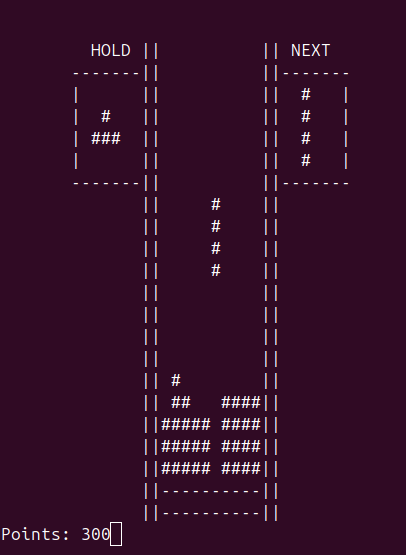

# Tetris Terminal Game

This is a simple implementation of the classic Tetris game that runs directly in the terminal. The game is built in C and uses the `ncurses` library for handling terminal graphics and input.

## Features

- You can play Tetris ^^.


## Prerequisites

Before you can compile and run the game, ensure the following dependencies are installed on your system:

- GCC (GNU Compiler Collection)
- `ncurses` library

### Installing Dependencies

#### On Ubuntu/Debian-based systems:
```bash
sudo apt update
sudo apt install gcc libncurses-dev
```

## Compilation

To compile the game, run the following command in the project directory:

```bash
gcc *.c -lncurses -o tetris
```

This will generate an executable file named `tetris`.

## Running the Game

Once compiled, you can run the game using:

```bash
./tetris
```

## Controls

- **A / D / W**: Move the tetromino left or right, or rotate it.
- **Space**: Hard drop the tetromino.
- **Down Arrow**: Soft drop.
- **ESC**: Quit the game.

## Screenshots




fair evaluation :)
